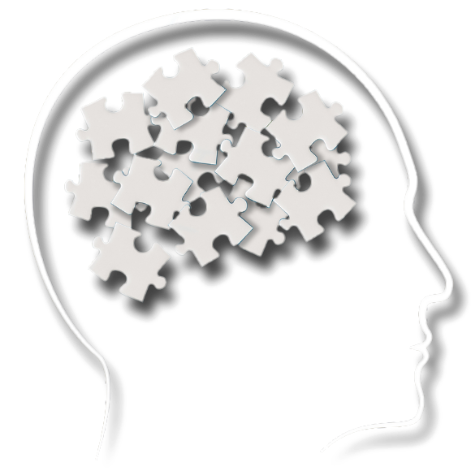

# O Escárnio em Prol da Saúde Mental

[`Regina`](https://psicologareginasouza.com.br/) mexia com psicanálise e foi recomendada pelo seu pai, homeopata. Seguia a cartilha que na prática se resumia a "bater papo". Otimismo, "ver a vida de outra forma", sugestões vazias. Consultas se alongavam sem resultado nem perspectiva de melhora.

`Mara` trabalhava em opostos: psiquiatra, mas também "espiritualista". Bem-intencionada, boa de papo, porém sem traquejo algum nos extremos além da esperança gerada pelos seus próprios dogmas. Tinha seu prazer politicamente incorreto: fumava, fumava... até que o fumo a vitimou. Padeceu com seus 70 e poucos anos. No fim, enquanto outros esperavam serem salvos, a salvação não veio nem para si mesma.

[`Fábio`](https://agenda.fabionasa.com.br/institucional/sobre) era hipnoterapeuta, baseado nos capciosos métodos de "reprogramação mental": colocar-se num estado de profundo relaxamento, imaginar-se num campo florido, a fim do subconsciente estar mais apto e receptivo a mudanças de mentalidade. Um dia, porém, Fábio desapareceu. Sem deixar vestígios. Número apagado no WhatsApp. Raptado, esquecido, ninguém sabe.

[`Eduardo`](https://www.molinaterapeuta.com/), um coach. Carismático, sabia capitalizar as agonias alheias, tinha sempre uma resposta pra tudo. Acreditava no "poder das palavras", _micromanagement_: não poder falar "meu problema", apenas "problema", pois caso contrário você estaria "validando estigmas negativos". Modelo predatório que prometia milagres em apenas três consultas. Depois, desambiguava para outras: _constelação familiar_, recomendações, propaganda automatizada no WhatsApp.

[`Sheila`](https://www.drasheilahauck.com/)...

Sheila lidava com remédios. Sua razão de existência. Aproveitava-se da brecha psiquiátrica que a permitia ganhar seus 500 reais (ou mais) por consulta sem praticamente um pingo de esforço. Prosperava em cima de amostras grátis dadas aqui e ali, e o _gatekeep_ de acesso à medicação por meio das valorosas receitas dadas.

Não sabia muito o que estava fazendo, o que é de praxe nos dias de hoje: área com falta de profissionais, de comprometimento. Onde dinossauros ainda se mantém de pé devido às "décadas de experiência", aos contatos, às conexões.

Gostava muito de ir em congressos e palestras. Vivia a vida boa e achava que estava evoluindo na "carreira".

Diagnosticava os pacientes com "sintomas de depressão". O que é suficiente &mdash; afinal, para que confundí-los investigando a fundo e rotulando-os com mil e um transtornos diferentes?

Passava o remédio que mais funcionava nas cobaias e que deva na telha, ainda que [certos antipsicóticos fortes](https://pt.wikipedia.org/wiki/Olanzapina) jamais deveriam ser prescritos para uso contínuo e prolongado (muito menos por quase dois anos, como de fato foram).

Mas, no fundo, não havia nada do que reclamar. O dinheiro era máximo, o esforço e a interação eram mínimos. No fim do mês, poderia descansar feliz sabendo que seus R$ 30~40 mil caíram na conta, e que ninguém poderia fazer nada a respeito disso. E assim se seguiria até a aposentadoria (que poderia muito bem ser postergada &mdash; afinal, tal trabalho tão nobre merece continuidade).

---

## Os três pilares

#### Não há investigação, não além do nível superficial.

Após a primeira consulta, o iluminado terapeuta já sabe tudo o que precisa, e _"ovo te curar a partir de agora"_. As próximas se resumem a apenas aplicar a cartilha e os tais métodos _ad nauseum_.

Em geral, não há preocupação ou vontade de descobrir entraves, bloqueios, fatores genéticos ou consequências psicossomáticas. Tudo se resume às meras platitudes das "formas de pensar", do subconsciente, do _mindset_.

De minha parte, tudo que recebi oficialmente até hoje foi o clássico combo-diagnóstico de **_ansiedade_** + **_depressão_**. Por outro lado, suspeitas e conclusões tanto pessoais quanto de terceiros não faltaram: desde transtorno Borderline (TPB), pós-traumático complexo (TEPT-C), TDAH leve... e por aí vai.

#### Não há procura por desenvolvimento pessoal.

É a _parábola da gorda plus size_:

<blockquote style="font-family: monospace;">
  "Doutura, eu não estou me sentindo bem com meu peso :(" 
  <i>"Que bobagem! Você é linda do jeito que é. Quem te disse que estar acima do peso é um problema?"</i> 
  "Ninguém, é só eu mesma que não estou feliz com meu corpo..." 
  <i>"Viu? Isso é tudo coisa da sua cabeça. A sociedade bota esses estigmas na gente. Tem nada é que dar bola pra isso."</i> 
  "É, eu sei, mas... até que seria bom se eu conseguisse emagrecer um pouco..." 
  <i>"Olha, nessas horas, o melhor que você pode fazer é esquecer isso e focar em coisas mais positivas. Vamos lá, me diz o que você mais valoriza em si mesma? Vou te ensinar uns métodos pra praticar (...)"</i>
</blockquote>

#### Não há foco em mudança de rotina.

Vive numa realidade extremamente estressante na faculdade ou trabalho? Possui sono atribulado, alimentação desbalanceada? Sente-se solitário no dia-a-dia, gasta horas de condução tendo como seu próprio enredo o futuro incerto? Nada disso conta ponto. O be-a-bá já está pronto desde o começo: para o terapeuta, a "reprogramação mental"; para o psiquiatra, domar e reduzir tudo ao mero controle dos níveis de dopamina e serotonina &mdash; como dar suplemento vitamínico a quem jejua e pula o almoço.

De um jeito ou de outro, a essência é clara: o famoso _"passar perfuminho na bost@"_.
 
Feito isso, criam-se as falsas esperanças e perspectivas de melhora, alimentadas pelo _gaslighting_ de cada sessão. Uma encadeia outra, e outra, e outra... e os problemas não vão embora; muitos de volta à estaca zero. No fim, descobre-se que apenas foi perdido tempo, dinheiro e ânimo nessa empreitada. A fé na solução mágica diminui; e você começa a achar que o problema é _consigo mesmo_, e não com o _sistema_.

(seria essa a tal _ética profissional_ de que tanto se gabam?)

Funciona pra alguns? Depende do caso, do quanto fora do eixo o indivíduo se encontra. Matar uma formiga e assassinar um presidente são incumbências com níveis de dificuldade radicalmente dispares.

Ademais, pessoas diferentes são susceptíveis a tratamentos em níveis diferentes. Mulheres &mdash; no que me perdoe o politicamente correto que nos julga por mencionar a verdade &mdash; são mais influenciáveis a tais métodos e estímulos por padrão; e o mesmo vale para pessoas de QI mediano e abaixo.

_É como um livro de auto-ajuda ao vivo e a cores, pago em inúmeras prestações semanais._

Infelizmente, livros de auto-ajuda nunca me ajudaram muito (com o perdão do trocadilho).

---

## _Quis custodiet ipsos custodes?_

Quem vigiará o terapeuta/psiquiatra? Nessa área, todo mundo quer vender o próprio peixe.

Terapeutas vão acreditar que seu tratamento é o melhor do mundo e que há de funcionar inequivocadamente em todos os casos. Psiquiatras, por sua vez, vão delegar a responsabilidade aos primeiros.

Não há um _pipeline_ corretamente definido para um jovem que (infelizmente) entra nesse mundo de tratamento sem fim:
1. começa-se com recomendações (seja de parentes, amigos, ou simplesmente buscas aleatórias na web)
2. encontra-se uma possível forma de tratamento "ideal" (freudiana, jungiana, cognitivo-comportamental, hipnoterapia, etc) ou simplesmente pula-se essa etapa
3. escolhe-se o profissional em si (seja também por recomendação, ou fatores como fama no Doctoralia, atendimento na mesma cidade, possibilidade de teleconsulta, etc)
4. inicia-se o tratamento e deseja-se o melhor para si mesmo, repetindo-se o mantra de esperanças renovadas, "vai dar tudo certo", "estou em boas mãos"

Porém, a fachada logo cai, e finda a euforia inicial, os problemas continuam. O que era apenas um incômodo e estranhamento começa a te fazer questionar se essa era (ou se continua sendo) a melhor opção. Estando em cima do muro, só te restam duas alternativas:
- continuar na Síndrome de Estocolmo, "confiando" no terapeuta e dando tempo ao tempo até que alguma mágica finalmente aconteça
- desistir, engolir a seco, saber que não há como recuperar o tempo perdido, e encarar a dura realidade de que será necessário recomeçar do zero

Cedo ou tarde, a segunda opção é inevitável. Só que não havia ninguém para questionar o que estava sendo feito de errado.

Ninguém para te avisar sobre estar fora de rota. Ninguém com o olhar mais aguçado de poder metrificar que melhora nenhuma estava acontecendo, num mundo em que o tempo é precioso. Ninguém para quebrar o encanto e te guiar à luz.

Não há ninguém para vigiar o vigia.

---

Se defender ante ao sofrimento não pode ser feito com urgência, mas exige **_celeridade_**.

Existem "profissionais" e profissionais; mantra que muitos gostam de repetir. Entretanto, como algo tão sensível como a saúde mental pode ter os resultados tratados como loteria, com fatores "achar o cara certo"?

Não há como pleitear lógica no que é mero fruto do acaso.
