# The Enigma of Cognitive Dissonance

The text at hand here is primarily meant to:
- clear misconceptions about Riddler's decisions, logistics and technical details, to anyone good-intentioned enough to actually listen
- to serve in a way that can be considered as a _personal attack_ by others (and against those)

The facts, opinions, interpretations and arguments presented here are either mine alone or have been already subject of countless private conversations with acquaintances.

Yes, it's supposed to be big and yes, it's supposed to be exhaustive (in both senses of the word). Plus, screenshots galore (as I know people _love_ those).

As such, this is last occasion (and the sole one in years) I'll be ever addressing the points presented here. I figured out making such a centralized enormous piece of info public is not only a need but also a way for me to stop wasting time. As the saying goes: _Verba volant, scripta manent_.

I hope no stone is left unturned &mdash; but even if some do, this thing can always be expanded and edited later.

Last, but not least, if you see anyone diving into points already covered here, then please:
- don't engage
- don't try to discuss
- just link to this blog post

It will save everyone's time.

---

Let's just start with the best part straight away.

## Parmesan

First of all: why should we do it, again?

- "don't feeling good about my riddle there" isn't enough of a reason
- "don't liking the main dev" isn't enough of a reason
- "being apprehensive something might happen with the data" isn't enough of a reason

Just to be "nice"? "Etiquette"? "Special rules" of some _moral loophole_ exclusive to the riddle scene?

Maybe you should listen to what one of your gurus think about it:

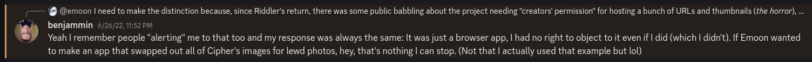

Whenever the subject is repeatedly mentioned (which happens _ad nauseum_), one of the inspirations for this project, [RetroAchievements](https://retroachievements.org/) always come to mind: a platform that behaves independently and works a shell over third-party content. They make a clear distinction between _adding achievements_ to old games and actually _hosting_ those (i.e ROMs) &mdash; and they can't do the former by any means as, after all, [we all know what would happen otherwise](https://www.youtube.com/watch?v=TRHv3d2CeaU).

<figure>
  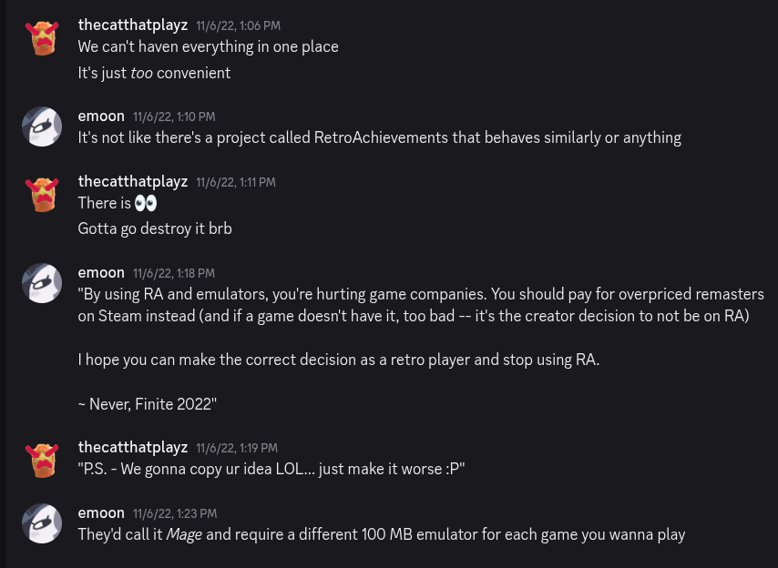
  <figcaption>in a parallel universe, this is probably how it would go.</figcaption>
</figure>

Likewise, there's also an obvious difference at play in R between _cataloging URLs_ and _hosting 1:1 content_. ***If***, at any point, we were to release a public archive of a dead riddle, ***then*** the best course of action would be, indeed, requesting prior permission _or_ complying to removal/unlisting requests. This is even a stricter version of what [https://archive.org](https://archive.org/) does, and not only a decent concession to be made, but also _my_ personal opinion on the subject<a href="#ref-1">1</a>.

The same questions go unanswered. What should we do about the following categories of riddles:
- the ones with dead/long-gone creators (some unreachable not even through Nordinho anymore)?
- the ones with absent/uninsterested creators (as none other than the OG Notpron and DavidM &mdash; even though some people there think they own that thing instead)?
- the ones without even a hint of _whoever_ the creator is (used to be the case for the Kermit one for years)?

If still in doubt about what is A and what is B, then please re-read the [Terms & Conditions](https://riddler.app/terms-and-conditions), the [Fair use wikipedia article](https://en.wikipedia.org/wiki/Fair_use)... or just give up.

And what about [this list](https://enigmatics.org/puzzles)? I see many instances of ~~riddles~~ puzzles fitting the labels mentioned just above. You probably didn't go after the makers of pretty much _half of the whole list_. `"OH but that's just a simple catalog of puz-"`... ah. So _cataloging stuff_ isn't a problem anymore ain't it? Or is it about ***what*** you catalog? But... where do you _draw the line_, must is ask?

Or, perhaps... as in many fields and situations in life, it's not about ***how*** it is done, but ***who*** does it?

There's another peculiar fact: throughout the first year of R's existence, there were _absolutelly no public concerns or mentions to this "issue", at all_. Same for the "encryption" talk (which is thoroughly explained some dozen paragraphs below). Both only started being a thing after the drama unfolded and the enemities formed.

So how curious... it's almost like, I dunno, this has just some _very convenient_ [Goebbels-ian lie](https://web.colby.edu/cogblog/files/2018/04/goebbelsquote.jpg). A cheap tatic like a baby crying to get his lollipop back, or a girlfriend denying sex. In other words: an easy shaming tool.

### There was a contract

When the bot was replaced in most of the riddle Discord servers, that contract was torn in half.

When people started to actively preach and act against R, that contract was ripped to shreds and ignited in flames.

Additionally, let's say if I/we were to concede and finally oblige to your _oh-so-moral requests_ of certain creators who hate me... what do you think it'd happen?
1. you'd celebrate it as as a victory
2. my 3-year old screenshots would still be floating around to show how evil I am
3. you'd keep larping as heroes for all the eternity

So much for me in accepting it, I see.

### Misguided opinions

That's not to say everyone with such requests had previous resentment at play. But as for the ones who don't... there are a particular case I can't simply leave unmentioned.

#### Abyss

For starters, with all due honesty... I have absolutely no recollection of [whoever you are](enigma/abyss.jpg).

Ah, but I did in fact leave. As proof, [this](https://github.com/EmoonX/riddler/commit/e2453f461bde2277790673b7e7baf0d8e93491e7) was the last coding update in years. The only caveat: there was no-one either capable and/or free enough to take the weight of passing the project to.

Likewise, it's also weird to say "I never left" when this project was down for absolutely almost three years. And there was no intention at all in _hiding_ my return given that it was pretty obvious for whoever had read [R's return announcement](https://riddler.app/old/level-omega).

What _I do am aware_, from what my friend geo told me, is that, humorously, one of your group buddies in DNBherL doesn't seem to respect much what's being preached.

<figure>
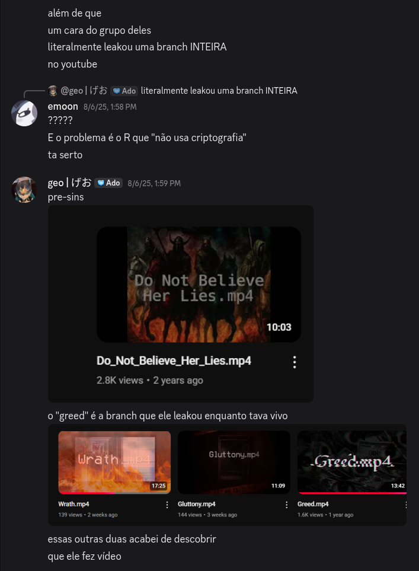
  <figcaption>Language barriers aren't probably an issue to understand what's going on here.</figcaption>
</figure>

I just hope nothing harsh happened to the `30` or so people in that server on August 8th.

### The fine print

Long story short, it can be seen such complaints come from essentially two kinds of makers:
- the ones who directly harmed me, my project, and the people who liked it
- the ones who had no interference at all in adding any content, yet either just repeated nonsense by proxy and/or couldn't even communicate properly for elucidation with us

So the real question is, for God's sake... _**why in the hell** should I/we bow down and oblige to such people_?

Now you understand why it's much simpler and the best for everyone (including us) to just stay at their own nest?

<figure>

  <figcaption>Used to be like this 3 years ago. Still like this now.</figcaption>
</figure>

This isn't anymore a project about `reaching creators with offers to add their riddle`, `setting up a Discord server`, blah blah. The priorities and _modus operandi_ changed ages ago. It is not something done of spite. It is a ***conscious decision*** supported not only by me but other admins. And we're not backing off on it.

If there was anything left of a bridge, you burned that way, way back in `July 4th 2022` (how convenient of a date). Nobody of those, at this point, has absolutely no right whatsoever of requesting drastic measures over third-party content on R. The only medicine against people who feign deafness and/or can't understand essential concepts is simply not playing the game.

_Less direct interaction, more third-party support_. Either you understand and concede to that... or there's nothing we can do.

---

## Dusted talk, reloaded

### Page harvesting

It isn't new. It has been in the codebase since over 3 years ago ([yes, really](https://github.com/EmoonX/riddler/commit/dae30fd5ef05c2c6fcd223b17a548649bed7c5b3)). It has been repeatedly mentioned (and/or hinted at) in  several announcements since the start of the year. It is mentioned in [this section of the F.A.Q.](https://riddler.app/faq#i-ve-found-a-missing-page-do-i-need-to-report-it-).

Most importantly, it is mentioned [in the Privacy Policy page](enigma/privacy-urls.png), which establish pages/URLs are harvested to the system. So if someone thinks we're "breaching privacy" by collecting "links" \[sic\], this means that either: 1. they haven't read the PP and/or 2. they can't interpret stuff for their lives and end up assuming spaghetti out of it.

95% of content comes from our own inner contributors. The remaining 5% are, basically, random eggs; several of which can't even be deduced to what level they are from without further info or by those external players intentionally DMing us.

Even if someone ***were*** to stumble upon unseen content for levels we haven't added yet, we still wouldn't make use of it. Why? Because not only our collaborators prefer _solving levels_ by themselves first, but also because we need to _understand how those work_, _rank_ them, and possibly devise achievements. In this process, arbitrary pages gotten beforehand by others have little use to us.

Long story short:
- the actual "sensitive" content (i.e levels, answers, etc) are almost exclusively obtained first-hand by our inner circle of collaborators
- what the general public (knowingly or not) adds to the collection are, almost always, just innofensive eggs for riddles that are already (or were since long, long ago) in released form

So much for an "evil plan" to make people "unwilingly collect URLs".

### Encryption

Now this is the icing on the cake.

What most laymen fail to understand, straight away, is the difference between _two-way encryption_ and _one-way encription_ (aka hashing). You use hashing, for instance, to hide passwords, and it works because _you aren't supposed to read passwords_, just compare the input hash to whatever is stored.

Is it the case for pages/URLs? Obviously not, because it needs to be _retrieved and read later_. So we fallback to _two-way encription_, which is a big step below in protecting data.

Oh, but does the two-way variant exist for database content? Certainly. It's called _field-level encryption_, and usually employed for sensitive stuff like e-commerce credit card data; which you can't and shouldn't hash, as the user needs to be able to retrieve and read it back (even in partial form).

Protecting page data, however, is ***still*** a level further below that. Why? Because such data is, by definition, _ubiquitous_ and _dynamic_. It is not something meant to be shown in a single place to a single user; but rather, in several places and contexts, varying in _which_ to show and the _amount_ of. This _heavily undermines_ the advantages of employing encryption for page/URL fields.

It's easy to envision the paradox in the claim itself: _if you argue that data X is sensitive, then you can argue that any data is. And if you encrypt data X, you can go and technically encrypt every individual field in the database. **Which makes no sense and completely misses the point**_.

Furthermore, there are a pleatora of additional ways data could theoretically leak:
- if the front-end ends ups listing levels or pages the player hasn't gotten yet
- if an admin page becomes mistakenly open to a common user
- if the AWS instance gets breached somehow (in which case the attacker would be able to do whatever they want)
- if any of the top players get their Discord account compromised (though I guess Discord's 2FA helps protecting against that... to which I doubt an additional in-house 2FA solution would be really needed)
- finally, if someone is ill-intentioned and decides to leak everything he has found so far, he'll be able to conveniently share all the URLs he has gotten and then it's over &mdash; and there's pretty much nothing we can do to avoid that happening.

What does all of those all have in common? _Encryption doesn´t help an ounce in mitigating them._

If there _is_ something where field-level encryption would be useful for, that would be against _raw database leaks_ (e.g usually in the form of SQL injects; which is I guess is where most people are coming from). Is it worth it? Nope. Not only because it would block not even 20% of the overall attack possibilities, but also because this area can be protected in several other ways: _by restricting arbitrary queries, blocking IPs, securing and making strong DB admin passwords_, etc etc.

To sum it up: data needs to follow certain _patterns_ and _restrictions_ for the encryption to truly hold and be worth of it. If it doesn't, then we'd be just complicating how we handle data in exchange for phony protection.

All in all, it is so naïve and shallow for some to think that, in a behemoth of a project like this, full of complex decisions and minute details I know almost like the back of my hand (which most people wouldn't understand even IF given an explanation for)... that I haven't implemented feature X the "obvious" way because `"lmaooo let's mess with everyone xDDD"`. OR, that I'm somehow _incompetent_ enough (projection?) in a way that people who never even toyed with a database in their lives &mdash; and several of which already proved their obtuse coding unsavviness around &mdash; to believe they know better than the programmer behind the codebase itself.

Furthermore, you also don't know about the additional procedures employed for other (and more subtle) security guarantees. Like the somewhat recent care in developing the (tiresome) riddle credentials feature (e.g to make sure no players got access to username/password pairs they shouldn't); in fact, there's a [whole ass section in the Privacy Policy explaining the rationale behind those](https://riddler.app/privacy-policy#riddle-credentials).

You see now how this is much more complicated than envisioning a bunch of garbled characters in the DB fields and resting safe about it?

And, much certainly, just because, at some point, a certain too-smart-from-his-own-good Hong Kong native (he'll be mentioned throughout this blog post, be ready for it) started this stupid argument, and the sheep followed.

<figure>
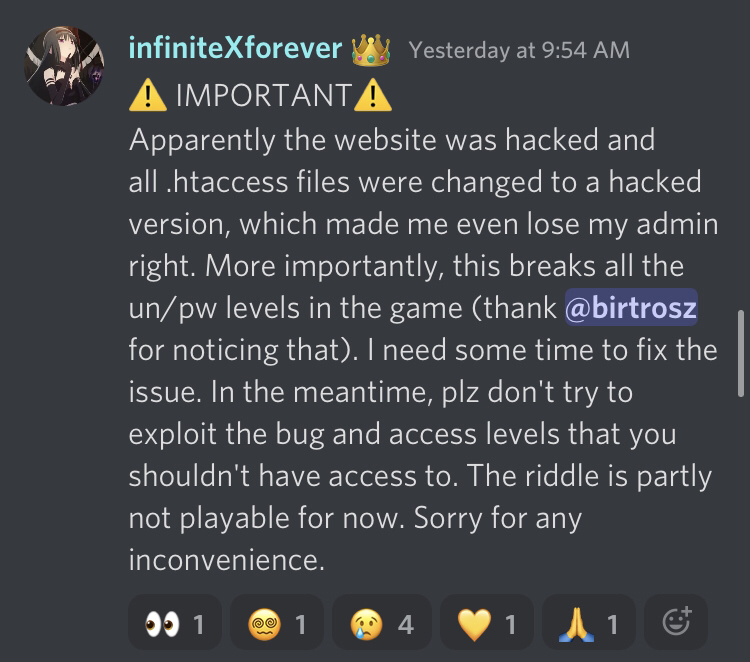
  <figcaption>In some esoterically comical way though, he proved by himself to apparently _not know much_ about said _security_ when it comes about protecting his own product instead.</figcaption>
</figure>

### "Middle ground? What is that?"

- _If someone is wary about having their riddles on R_: they could, you know, request merely some kind of _unlisting_. So the riddles don't appear publicly and thus there's no "involvement" with the platform. This, as a matter of fact, _already exists_ and has been even employed before (with a [certain riddle](https://riddler.app/string/) from someone who &mdash; purposedly or not &mdash; forgot this feature is even a thing). What people do instead? They shame and their request straight removals, no ifs nor buts.

- _If there are concerns about the way players harvest page data_: then maybe a _settings option_ to allow a user to especifically disable that? Or perhaps advocating to make it clearer in the Privacy Policy. Or maybe linking said Privacy Policy straight away to registered users. But no, instead, people imediatelly assume it as shady evil plan to gather data without consent &mdash; and that's given that we are in a niche where >90% of the riddle websites don't even have a PP to start with.

- _If there are repeated mentions about encryption_: then why no serious talk was ever taken part about it? No suggestions nor ideas to solve the so-called "issue", neither coding-wise nor in more general form. Instead, just amateurs with no programming background shouting about stuff they don't even know.

That's definitely not to say I would concur or agree in implementing any of that; especially after people jumped the gun and burned the bridge so many times already.

But those are _logical and rational solutions_ to the issues in question, plainly ignored by the outside parties. Because, evidently, it's much easier to preach conspiracy theories. _To imply we did something arbitrary out of ill-intention_.

People urgently need to understand that, in such a project with only a single developer, just half a dozen of inner collaborators, `15k` lines of code and [lots of still open issues on GitHub](https://github.com/EmoonX/riddler/issues)... that if we implemented feature X yet or not the way you'd expect, that doesn't mean we are being lazy, or inconsiderate, or intentionally relegating stuff. It's just that ***there's too much to work on***; and what it may seen "urgent" or "obvious" for you, isn't necessarily the case for us (or even in general).

As of proof of concept, no better example than what started the last BS:
1. people find out riddle Z has a level (out of the global amount of 1500 currently in the platform) accessible in R when it shouldn't be
2. creator of Z makes uneeded drama out of it &mdash; even to the point of harassing the messenger
3. turns out that the own creator of Z messed up when adding that level years ago (which is made worse by the fact levels back then had noticeable _hard requirements_, i.e you couldn´t record progress for a locked level without reaching the required ones first). Turns out ***also*** that the creator of Z messed up in his own website, by making that level always accessible to anyone straight away using a simple JS exploit (and alas, this isn't fixed even up to this day)
4. we make announcements debunking the false flags
5. creator of Z, nonetheless, still bitches about it and, based on _fake news_, takes the opportunity to do what he didn't in almost 6 months, and create a full-fledged boycott out of... <small>absolutely nothing</small>

So really... how can I (or anyone with half a brain) even take anything of this seriously?

Because ***resentment*** is, by default, just _individual_. It needs to be _materialized into something seemingly logical_ for the others to buy the idea. As such, people resort to stuff that appears to be "factual"; which is easily amplified among others who stumbled upon this "broken telephone" game by chance.

Yet, it has a price: it falls short easily when exposed by someone who _knows_ what they're talking about.

### Incompetence

With all said above, why not also take the opportunity to share some more of the "technical feats of knowledge"?

- Source codes with copy-pasted `
` and `
` tags galore, notwithstanding the fact those are nonstandard/invalid HTML?

- Barely having an idea of what HTTP status codes mean, save for 401, 403 and 404 (also, could someone tell us, please, what a `403` really is? If your answer is among the lines of "when you can't access a folder without an `index.xxx`"... then sorry, but you're wrong)?

- Trying to derefer [freaking dereferer.me]() (essentially, [this meme](https://www.youtube.com/watch?v=PgNIqwsWh6w))? Believing somehow that browser extensions have referrers, when your own script actually worked by recognizing accesses coming from _`riddler.app`'s outgoing links_ instead?

- Labelling the aforementioned (and the related string's server-sided solution) as _great work_?

<figure>
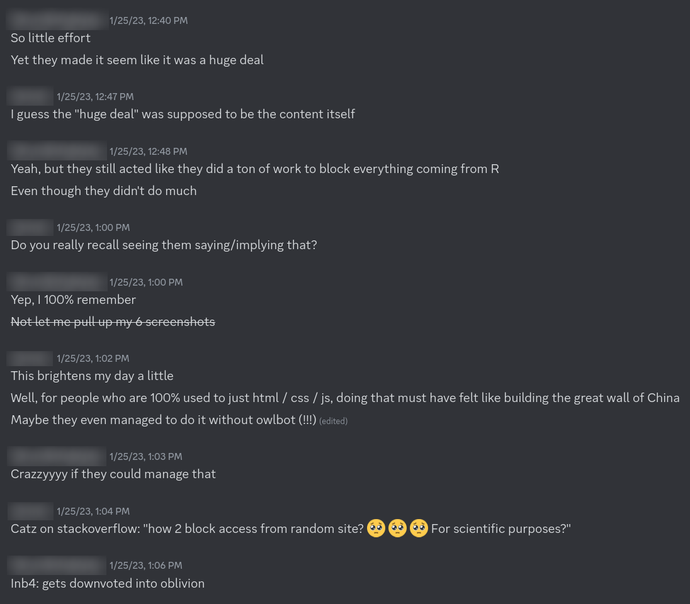
  <figcaption>And to think all I had to do was to add a `rel="noreferrer"` attribute to every external link (no actual `derefer.me` even needed)</figcaption>
</figure>

- Making their own credentials solution, and somehow managing to make it an option as bad as or even worse than the native browser one?

<figure>
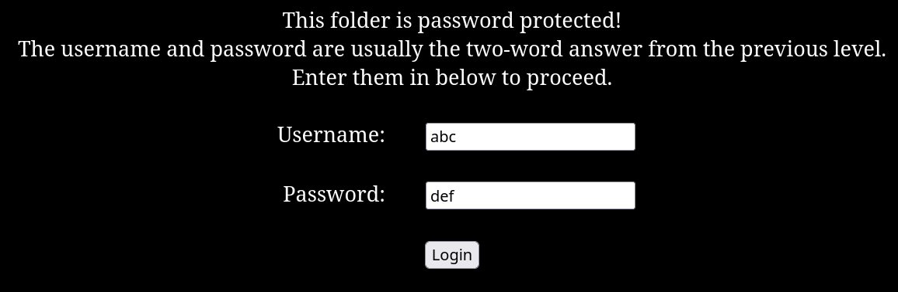
  <figcaption>No realm message? What's even the definition of "previous level" if you're accessing those through random links? At least, though, you copied my idea and fixed the `password` field to not show the unneded ●●●●● (took a few months... and don't go thinking I didn't notice the change).</figcaption>
</figure>

- Having a goal of "making a catalog of all riddles in existence", and even managing to have good progress with [almost `200` riddles within the first month or so](https://web.archive.org/web/20211020033512/https://enigmatics.org/puzzles/)... but then, pretty much four whooping years later, the list is barely 60% larger than it was, and that's counting third-party contributions &mdash; including people adding their own riddles (even if out of rightful interest)? Almost 80 entries are already dead (the great majority without any in-site indication) and some others are either an elaborate joke or those people clearly don't know the definition of an _online riddle_ ([like, for real?](http://www.mysterys-games.ch/tobys_adventure.html)).

Alas, I think we're done for now.

---

## A broken spell

Once upon a time, the creams-of-the-crop around took a step to have something [to replace R](https://github.com/RasmusAntons/wizard).

...not telling the rest of the story here, sorry.

However, if you guys, back then, were so interested in making a "creator-centered" solution or whatever... you could have just, you know:
- adapted most of the R ideas &mdash; with or without your own pr0n sauce
- split the content between several databases sharing the same table structure. Each would be owned by their own riddle creators/admins, and a _`P2PE user <-> DB key pair`_ would ensure the read/write occurs only in either of the ends. Which means the central system wouldn't be able to alter the data in any way and not even know what's written in it

And there you go. The same benefits without the hassles.

But this whole talk made (and still makes) no sense because it was built upon a completely wrong premise: _of rebuilding perfectly functional and unique software from ground zero_. Which is absolutely ***not*** how software engineering works, which would be accordingly shunned by developers taking part in any serious programming projects out there.

And done, mind you, as a ***predatory*** and ***exploitative*** move, based on individuals who took the opportunity of my downfall and acted as if their time to shime had come.

The result, of course, was laughably incomplete. No tracking on a page-by-page basis, just level-by-level? Having to copy-paste a JS script to _every freaking level_? No wonder it ended up being used merely as a bot in most of the riddles who chose to use it, save for two (String and Combinats) AFAIK.

The ***extension*** is/was the missing link. There's no Riddler (or similar) without it. It's no rocket science.

No extension, and I wouldn't have even bothered about creating the project.

But there _is_, in fact, one point that gets easily overlooked: was there any permission asked for copying ***my*** ideas for your bootleg bots (even if in incomplete form)? Or at least _acknowledgements/credits_ for that matter? Do people that arrive at those servers _even know_ the bots they use for their countless `/unlock` and `/solve` procedures (well, for the ones that still have those) were idealized and set up originally by the shunned yours truly?

Sure, there's nothing legally wrong with modifying something; and that's covered by [the license Riddler adopts](https://github.com/EmoonX/riddler/blob/master/LICENSE). But isn't it really so _curious_, _ironic_ and _hypocritical_ that the same people who care so much about the oh-so-holy pages being cataloged somewhere... are suddenly oblivious and silent about copying someone else's work?

Are _URLs_ sacred, but ***ideas*** somehow not? How convenient.

---

## Morality

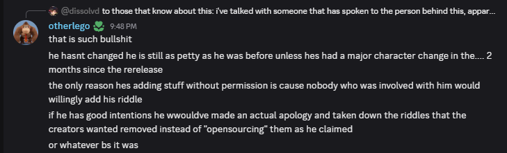

Now pray tell, moroniclego... "apologizing" for _what_?

- for presenting a free, ad-less platform that completely revolutionized the way riddles are played?
- for, nevertheless, being shunned out of scene and having my aforementioned personal project boycotted and killed?
- for, at the time, having potentially wasted _hundreds and hundreds of coding hours_ myself?
- for worsening my (by then) almost-a-decade-long depression, and fuelling my C-PTSD?

And doing it to whom? To people who larp as moralists but somehow manage to do even worse?

As in many scopes of life, humans tend to overlook two very importants concepts at play: ***context*** and ***reaction***.

When someone puts so much _effort_ and _love_ into a piece of work &mdash; as I did &mdash; to even the point of despair when things go awry, there surely has to be something else behind all of it, the actions and thoughts, than a mere desire of _power_... don't you think?

### A leakage

Answers got leaked, (some) people got mad.

About that, again: no regrets, nothing to apologize for.

The true reason for that? A lot of ongoing resentment for a whole year, obviously. In the span of just four months around mid-to-end 2022, not only I had to undergo the humilliation and the collective ingratitude of having my whole work vilified and going away<a href="#ref-2">2</a>, but also lost a 2-year friendship with someone who snubbed it (he knows exactly who he is) and found out that a dear professor of mine who I liked much from the college times had passed away. I was lost in life.

But I digress. Nobody wants to hear or care about that.

And it did work. It did work a lot better than expected. The torturing bad memories and trauma gave place to ***satisfaction*** and ***peace of mind***. I could finally focus on other stuff, even though I still couldn't even look or touch that thing's code (and it continued being so for a whole year after the leak).

Some folks went into a _paranoia_ state thinking everything was going to be leaked. Someone even thought [their semi-obscure riddle](https://awathapokoi.neocities.org) was relevant enough to be chosen for the massacre and changed literally half of its answers (no, seriously).

Evidently, that wasn't case. Everything was _hand-chosen_.

ARFAC was spared. Combinats was spared. Mishu's riddles were spared. Visions was spared, and other minor ones, and so on. Croc and Énigmapédia were more a lighter case and had their final-ish and secret levels spared. Finally, Cipher was more like a _gentlemen's agreement_.

<figure>
  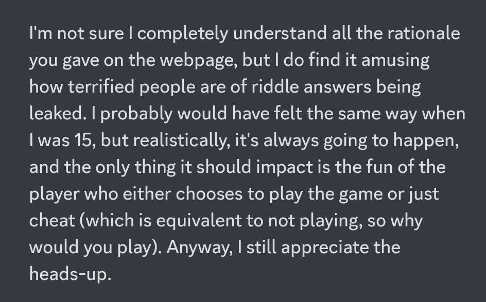
  <figcaption>As far as Cipher goes, its owner has gone past the age of caring about such stuff.</figcaption>
</figure>

### Conveniences are volatile

Naturally, you tried to label it as "world vs `emoon`". Because it also is _**convenient**_.

By antrophormizing Riddler and amalgamating it with me, the line blurs, and criticism gets much simpler. It's way easier to boycott a person than it is to boycott technology.

And, indeed, people used to think at first this was an nefarious one-man plan to rule the scene. As evidenced by when some cunt reached _my personal friend_ asking him to delete our server (more on that later on); or when others dumbingly enough thought that I monopolized DB access.

<figure>
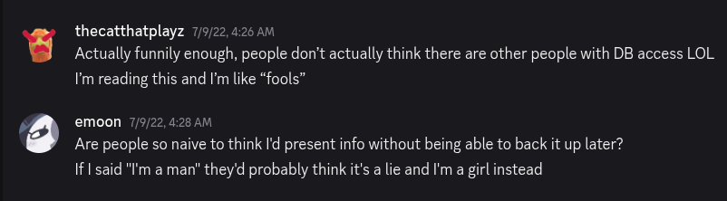
  <figcaption>I wouldn't be surprised by the latter accusation nowadays.</figcaption>
</figure>

Then, recently, the tides have changed.

In a 180 degree turn from before, the `Riddler = emoon` equation becomes untruthy, and people have no shame anymore in attacking admins, collaborators, and even people who are merely using the project and got caught in the crossfire.

<figure>
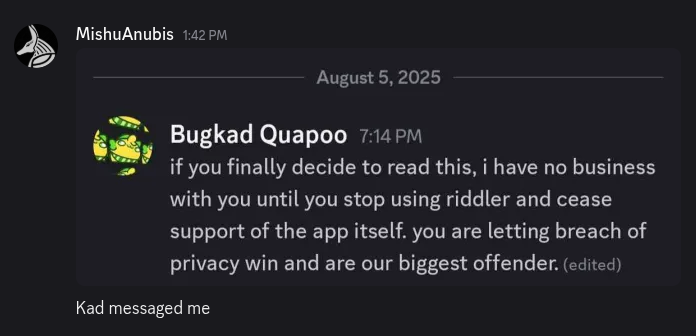
  <figcaption>Hostilizing one of the legends of the riddle scene is something I don´t know whether to label as _audacious_ or simply _plainly stupid_.</figcaption>
</figure>

<figure>
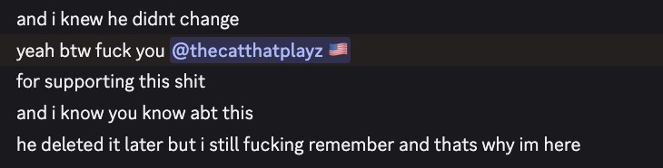
  <figcaption>Not even your one of the nicest individuals around (and former riddle buddy of yours) is safe from the clutches of cancel culture.</figcaption>
</figure>

<figure>
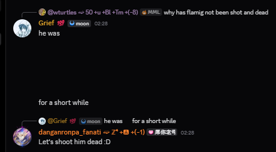
  <figcaption>Don't (literally) shoot the poor messenger, kids.</figcaption>
</figure>

You know, I do believe it's fine to hate me. No, really. Some folks have their reasons too (either if valid or not) and hey, this is the Internet. You can't force people to like you &mdash; yet you can get others to dislike you. That's the side effect of being involved with something that revolves around so many users.

But I ***absolutely draw the line*** when you try to kill useful technology.

You'll never be seeing me childishly preaching against technology. Because I prefer to preach against _people_ and their _faults_ instead. At worst, you'll see me joking about and pointing inconsistencies in your bootlegs and arguments &mdash; and boy, that's fun to do &mdash; but you'll never witness me trying to take anything down. 

Plus, I draw the line again when you sadly start to involve and harass others just because... they have some relation with me?

Shockingly enough, all that I have are _friends_ and _supporters_. Not a personal army; nor some popular ones you'd cowardly cling to and reach to act in your place; nor a mob to change all their statuses to `Stop using R!!1!` and conspire to take it down (while simultaneously preaching it's about _goodness_ and denying no spite-driven/circlejerking behavior in their attitudes).

And food for thought: perhaps some of our faithful players stick around, use and support the project because they do ***know*** about stuff your don't? And that, by being around (and having direct contact), they have a deeper understanding of my motivations, feelings, goals, and the logistics and inner workings of the project itself... than whoever has been shouting on the other side for years, out of their own biases, in this broken telephone game?

Now you get one of my main reasons for writing such a long-ass text disclosing and exposing everything here?

---

## Glass ceilings

Enough of logistics and technical babbling, let's get to the exposure itself.

### A pr0n experience

How can we forget about the best mutual group of friends in the riddle scene?

A sissy who exploits level leaks3</a>, stays silent about it to play as the "mischievous cuttie", and when called out for it, starts spreading behind-the-scenes gossip to convince others; but then was the audacity of calling _me_ "manipulative" (a joke in itself)?

<figure>

  <figcaption>Given your country flag, I think in recent times you've learned the hard way about the bittersweet taste of _cancel culture_ yourself.</figcaption>
</figure>

The Croatian hoe, the moral prostitute of the riddle scene, who absolutely never even created an account in R, but nonetheless appeared after in Cipher's server after a whole year absent, taking advantage of my lost mod status and the moon-hate bandwagon, just to be rude with me; and who later stayed using her (and her friends') own website to keep spreading propaganda against the project?

Some Fritz who manipulates me into a conversation, just to deive into generic judgemental trash talk defending his friends and then cut it abruptly at the end? Then again, I've dealt with (and witnessed) enough of you people in the interwebz to know that, usually, you guys are always the same: rude, insufferable, morally obtuse, and still probably trying to make up for the disgraceful things your great-greatparents did 80~90 years ago (sorry, I guess I'm just taking the opportunity here to be unapologetically xenophobic here).

<figure>
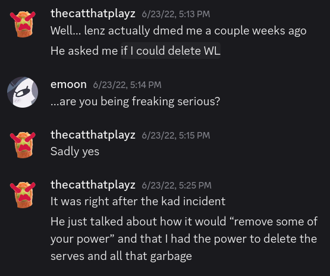
  <figcaption>Either back then or now, Ger卐ans have always been eager to apply a "final solution".</figcaption>
</figure>

A chileno loonie who decides to leave all the riddle servers the bot was in, just because he didn't like a certain new feature from [a moderation bot](https://loritta.website/us/), implemented back then to ease the our work (what's funnier is that said bot was present in just _two_ of all the riddle servers the R bot was in &mdash; probably got so scared that he left them all).

Some Elder who feigns _neutrality_ for his own gain, getting to the point of essentially labelling my own work as _come-and-go technology_? 
_Protip: don't go saying that to a programmer dedicating his spare time in making something free for you all. Unless you plan to be signing your own death warrant._

It's kinda hypocritical... to think that those dudes hail from the OG Notpron &mdash; with the first two even being mods there &mdash; which is know for its creator and his excentricity: from the 18+ content present in his riddle to his obsession with certain controversial stuff like ["alternative" medicine](https://www.5bn.de/).

And really, it's fine! Not only that, but I respect and _appreciate_ people thinking and acting outside of the box. Which has been, pitifully, greatly lacking around, as many can tell.

### Brilliant (and not so briliant) minds

There are four kinds of riddle makers.

The first one is that who, disconnected from the whole situation at first (and even a good deal in the years to come), acts badly; not out of ill-intention, but power and pressure. However, comes to resent the outcomes later on and understand there are deeper stuff in play beyond the surface.

I hope I can see you again, ideally ~~before the end of time~~ in a few months.

The second one is that who played a vital and immensurable part in the project's dawn, by helping beta-test it for the first a month and a half from its conception, back when nobody cared or even knew. Who, in a sad turn of events, was indirectly responsible for the bad move in the Cipher's server which still echoes as a domino effect up to this day. Who also later on went to grow resentment against me.

However, I am aware that your situation is different and has more than meets the eye.

You had the rights in being angry. I know you were hurt. That you acted and felt badly out of impulse and legit resentment and not by just jumping on some hate-bandwagon like others did. And no better evidence to that than the fact [your riddle updates](https://rnsriddle.com/category/update/) suddenly halted following a certain famous leakage.

Nobody around can rewind time... but I do hope you're happier where you are now.

Then there's the celebrity. And oh boy, how much can be said about this one.

If sharing answers is ["stooping too low"](https://zedpuzzle.neocities.org/craters/knight)... then what can be said about someone who uses their own Discord server to spread influence against another party &mdash; and precisely having done so just because you didn't like the [presented counterargumentation](https://riddler.app/old/lorem-ipsum), saw it as a "personal attack" and felt compelled to play dirty and going all-in?

If I am a [hypocrite](https://zed.archive.riddler.app/youmotherfucker.htm)... then I probably should remind you (and probably nobody else knows this for a fact) that ***I*** was the one to[_personally reach you_ with an offer to add ZED to the platform. And that, by doing so, your riddle not only got itself rid from having to use jurassic PHP forums ever again, but also kickstarted an exponential playerbase growth which was pretty much essential for it to stablish itself as one of the most popular ones nowadays.

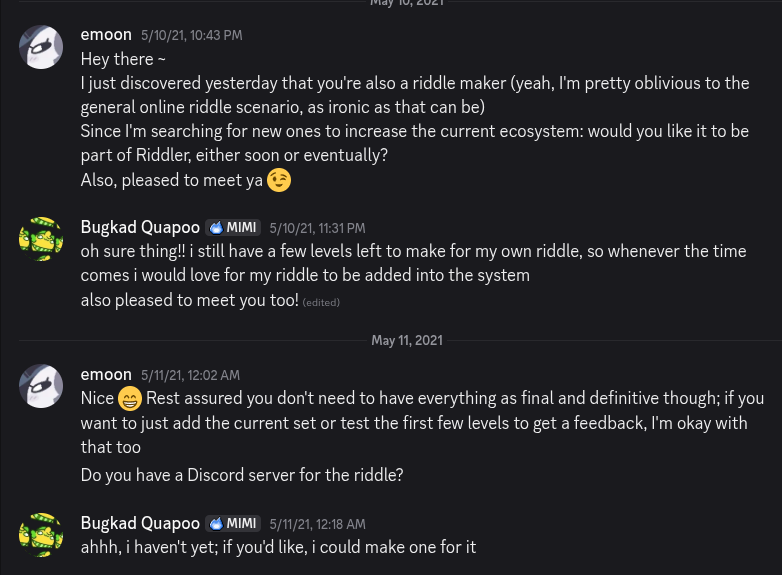

So I just wonder... how many of your players do you _owe_ me? A third? A half? The rest of that probably came from your smile girl xwitter and your 3-year old consecration in being active in your own Discord server (and to think merely 2 or so around Discord made me ill and to the point I started rethinking my whole life).

The most peculiar part is... why didn't you have anything to say for the almost six months or so leading to it? Why did you wait for a false flag &mdash; and getting offended up next by a inconsistency in your argument &mdash; to take _action_ against such an evil technology? Isn't that kinda strange?

Even that last announcement about zed, truthfully, was a _calculated risk_. I knew there was a chance you'd overract to my response when proven wrong. [I called it](enigma/kad-overreact.png)... and I was right.

Larping as the "defender of privacy" when you're literally _stalking_ people as of late? Having your kiddies denounce and hunt others? And I'm not even gonna talk about my ancient screenshots still floating and being shared around.

Then, just recently, I stumbled almost completely by chance upon a [certain rant](enigma/kad-rant.txt) of yours (which apparently went up just a month after you and your lovely gang drove me out of the scene).

And oh boy, that was like digging for gold and finding diamonds.

To clear an age-old misconception: no, I didn't _doxx_ you. Because, as a matter of fact, _that data was provided by yourself thru your **Paypal account** when you donated to the project_, way back then. So 1. I didn't make it public and 2. you directly shared that piece of info with me. As such, I didn't go looking for any unseen information nor on a hunt searching for social media accounts or whatever crap of yours. You can rest safe at that.

It's also funny how you complain about [a certain toxic troll raiding your server](enigma/raychiu-raid.png). Had you applied [the simple and common Discord solution](enigma/discord-timeout.png), you could have greatly attenuated the issue much before it started getting out of control. Not only you didn't do tit, but when I instead came with the idea of applying a global solution due to the ***very same player***, it got labelled way later instead by your HK weeb friend as me "trying to interfere in the riddle servers". Welp. I guess you all got a taste of your own medicine.

And quite honestly, reading all that... it leaves me with a sweet feeling in my mouth. Because, if you, instead, were to catch a glimpse of my mind, for a few hours, in my direst times... you'd know the true meaning of the word ***suffering***. What _mental hell_ is indeed like. You'd probably feel like putting a gun on your head (which shouldn't be hard to get around you) and _offing_ yourself. It's kinda cute.

After all, even three years later, even after you've became some kind of _celebrity_ in the riddle scene (given the nauseating amount of `inspired by zedpuzzle` riddles I stumbled upon recently &mdash; with or without the ugly copy-pasted homepage), even after you had the _satisfaction_ of being ultimately the main responsible for shutting down an useful project indefinitely, you _still_ seem to have some ***PTSD-ish***-driven resentement more against me. As shown by how, not long ago (in fact, just shortly after R's return), you dropped the bomb and killed the usefulness of your own server.

<figure>
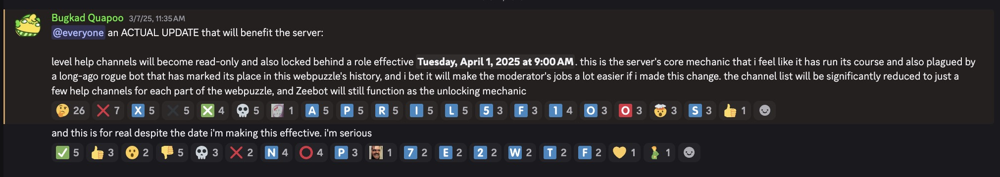
  <figcaption>No need to further comment on this, as the emoji reactions are more than enough.</figcaption>
</figure>

You are ***dumb***, kad. And no, there's no punchline. That's all there is to it. Dumb.

You're an expert at making art and devising/solving riddles... but that's pretty much it. You fail big time at programming, you fail at critical thinking, you fail at argumentation. You're the average autistic/neurodivergent savant whose whole personality and opinions are based on whatever you absorb like a sponge from the surroundings. And ignorance, for the good of the bad, is a _bliss_.

<figure>
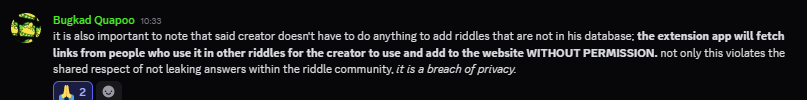
  <figcaption>"let me throw some big boy words about concepts i barely know so people are convinced i'm fighting for something grand here".</figcaption>
</figure>

And what does such a dangerous `popular + childish + stupid` summation brings you to? A ***sociopath***.

Which, ironically, is what you friends liked so much labelling me as in the past. But there's a vital difference. I didn't have Catzes, Lenzes and weavers back then to pratice oral sex on. And neither do I have nowadays a sizeable Discord server to preach half-baked truths to yes-kiddies that'd always agree with me.

<figure>
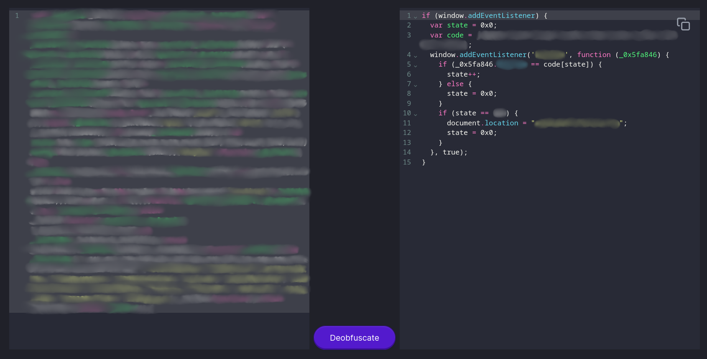
  <figcaption>And with all said and done, that uber-secret level is still pathetically reachable through simple JS deobfuscation.</figcaption>
</figure>

Last and least, there's the one who pretty much acted as a smartass and out of pedantic self-interest since day one, and kept doing so.

You know, way back when R went down for the first time, _you merely had to shut up_. We had already made amends several months before that, and I even _actively tried_ to be nice with you later on. Once I was out of scene, I didn't plan to further interact, and a mutual position of neutrality would be the best for us both.

But no, instead you had to play the hero.

You took advantage of my downfall, the ***privilege*** of being on the "winning side", unburied whatever resentment you still had against me (either directly or _by proxy_ through your friends), and dived head on in the `wizard` idea. Even had the audacity of using _my_ own Wonderland server to preach that your "professional group of coders" would be "making something even better than what we had before"<a href="#ref-4">4</a>.

When proven to be such a state-of-the-laugh flop, though, it was too late to turn back. You had already left your `180k` points behind and you had to cope somehow by keeping with the flow and shaming R with your parmesan nonsense (which probably either first came from you or your Asian fella RNS &mdash; both of who fail big time when trying to think outside the box).

Then, you kept saying crap. You set a referrer-wall on your website with the help of your pr0n buddies (who apparently all made a [big deal](enigma/string-groundbreaking.png) out of such an _outstanding_ programming achievement), played the victim card (after all, you were [_scawwed_](enigma/fxn-moon-scary.png) of me before), threw a mix of no-context half-truths and nonsensical arguments, and called it a day.

If there's some kind of person I hate more than a _smartass_, that is a _treacherous smartass_. As such, you can keep being rewarded with [funny texts](https://riddler.app/old/string-leak) et al as fables of your personal nonsense.

We don't care about your Wikipedia-driven average riddle not even as close as you think we do. But _I do care_ about keeping it forever if is about sending a message and make you mad about it.

What really surprised me is that, wow, [you _can_ actually code something](https://thestringharmony.com/riddlimg/). Though it uses PHP, so perhaps I should withdraw my comment. A pity that I plan to obsolete it<a href="#ref-5">5</a> in a future extension version... however, it will be nice to work on something that is _not_ complicated backend stuff for a change.

Ah, and by the way... I won't be circumventing your "custom GUI credentials solution" by any means (save from whatever lousy fix to make players able to record progress properly). Not only because it's beyond the scope of the project to account for such interfaces; but also, as the saying goes: you never interrupt an enemy when they're making a mistake.

---

## Closure

There's nothing you can do.

You want to stop using the platform due to thinking you're "collaborating with something bad" or convince someone to do so? Just like any other forms of ***slacktivism***, you'll be accomplishing pretty much nothing.

What do you think `riddler.app` is? Some Instagram page where you report it and it goes away forever? You can't "shut down" it. You can't remove a single line of code from existence. You can't delete the database backups.

Unless you find something truly _illegal_ there (to which _"he's cataloging online game answers without permission"_ and _"he did meanie stuff years ago"_ aren't good arguments for, I believe), you won't be taking out neither the website, nor the extension, nor the bot.

Even if, in a _fabricated hypothetical situation_, I was forced to "shut down" R or whatever... why do you think I'd go down that easily?

That's like pushing your luck against a judge who could throw you in jail at any time. Were I in a situation where I had nothing to hold me anymore, I'd further leak, I dunno: the negatives of ZED, all of Poly, Abyss. etc etc etc... that would be quite the content.

But that's not the situation at hand here. By making R alive and thriving, we both make nice people happy and arseholes mad for a great amount of time... so why should I do otherwise?

Stuff will keep being added and gears will keep spinning as long as the main collaborators are around. As far as new content goes, _a single active collaborator_ is worth more than `100` common players. It's not an exageration nor a jab at anyone; but merely a fact.

Ad revenue? There's none. So no money for me to earn in this either.

Want to go changing answers? That's nice, a good opportunity to people to solve your levels again and us to employ our [page change admin script](https://github.com/EmoonX/riddler/blob/master/web/web/admin/page_changes.py).

Want to put defamatory pages against R online? That's fun, just don't forget about what a [browser extension can do](https://developer.mozilla.org/en-US/docs/Mozilla/Add-ons/WebExtensions/Content_scripts).

You _could_ be affecting my ego (and boosting yours; after all, this is what it's all about) by temporarily slowing down the activity for weeks or even months... except that I won't care as I won't be around this time to witness it.

And that's not even taking into account the fact that making me having less reasons to code just means that there will be fewer updates, _including_ occasional security/privacy ones to attenuate the very same complaints you guys were so concerned about.

Not my issue anymore. It's my life, and you dug that hole anyway.

### Time is fluid

Furthermore, I've experienced enough mob-dynamics behavior to know how short such tendencies fall. You can use the _momentum_ in your favor for a short while, create _drama_ and think you're doing something _big and everlasting_; but how do you plan to keep it up later? What about 6 months from now? A year? Two?

The riddle niche has been around for over ***20 years***. R went down for a whole ***30 months***. Time isn't an issue at hand here.

You want me to believe, with a straight face, that _random hyperfocused autistic boycotts_ have enough fuel to last for the long run?

A year or two from now or so, when the majority of the mainstream riddles will already be all cataloged, released and archived... what do you plan to do?

You can't control the older people who just want to play stuff the better way and could care less about your empty morals. You can't control those who arrive at R through web searches (and more and more are bound to, given the vast amounts of riddles and SEO improvements). You can't control those who don't live around Discord and have better stuff to do than spending time being indoctrinated by propaganda-spreading zoomer riddle servers.

And, finally, now you won't be able to shame/harass/denounce/force people using R, because they aren't obligated to make you know anymore what they're doing. Which is something that I, sadly, overlooked for way too much time: the fact that several players refrained from using the system not due to some moral bogus, but just because they didn't feel comfortable in having their usage exposed. Some just want a helpful tool and not a platform. You could say that's the ***true*** right to privacy &mdash; which is being purposely ignored by the ones who don't practice what they preach.

### It is about revenge, of course

How couldn't it be?

I didn't come back to the thing just to fragilize myself once again. Neither to get in _nice agreements_ with fellas I prefer to stay at a good, good distance from. Nothing of this is new, and it has already been established [since the big return](https://riddler.app/old/level-omega).

What for you guys is mere inconveniences ("don't feeling good" about having a riddle on R, having the trouble of altering answers, etc), for me it was an _immensurable amount of time in my life potentially lost forever_. Which, thankfully, for my own well being, isn't the case anymore.

Why should I care? About those who don't listen? About those who repeat the same dusted denied arguments, over and over again? About those who, in despair, incite the masses just because they can't do it alone? Who recently went even _hunting_ and _controlling_ what others use or do?

There are niches where I want to pave my way, be nice with everyone. The riddle one is not among them; it stopped being ages ago.

### The silver lining

On the other hand, it also isn't just about revenge either.

I want to see nice people happy. I want to see people _excited_ about the riddle catalog being expanded. And it's bound to happen, with or without me in the scene.

While some focus on ***destruction***, we focus on ***construction***.

While some make nonsensical claims about "privacy" while kicking players from your servers, we allow them to play on incognito so they can use whatever they want without disclosing it to a anyone.

While some are scared of "data being centralized in one place", we are about riddles becoming _lost media_ and buried forever. Thus, we embarked on the noble mission to do what nobody cared or could before: _to save old riddles from their eventual death_. And so shall it continue, choose you or not to ignore/vilify such an act.

And now that the main dish has been served, I can safely remove myself from the anxiety/pressure-driven programming/cataloging work and watch the riddle capital being engulfed in this beautiful mix of ***order*** and ***chaos***. Nothing can stop the future.

And so should it be, as my occasional playground. Others are capable of continuing such a great piece of work, so I can finally focus just on QoL coding improvements here and there.

But since they're not `emoon`... try to not go _that hard_ on them, okay?

---

In the end, there are two facts to be extracted from all this:
1. How antithesical is a niche where people simultaneously exceed at logical thinking and can fail so much at critical thinking.
2. If you're going to have revenge anyway, make it useful.

From me, there were no more regrets already. And now, finally, there's also nothing left to say either.

---

<footer>

1. [^](#1) If you dig enough, you can find an ancient post of mine in the Cipher's Discord server disclosing a very similar stance.

2. [^](#2) One little known fact is that R was never explicitly meant to go down at that time. It simply happened because, one day, the SSL certificate for `riddler.app` expired, which made then the Chrome Web Store taking down the extension for ["not providing promised functionality"](enigma/yellow-magnesium.png) (?), plus the fact that I would have to go to a (then) complicated process to recover access to the AWS instance due to having lost the RSA key pair for it, and... I didn't have the energy to bother or even care anymore. Thus, it just stayed dead.

3. [^](#3) Did it before it was cool?

4. [^](#4) These last two quotes arent't sarcasm. Both were said, _ipsu-literis_, and they made people really believe in it. Yes, you can laugh.

5. [^](#5) And nope, once again, [not making stuff up](enigma/extension-images.png).

</footer>

